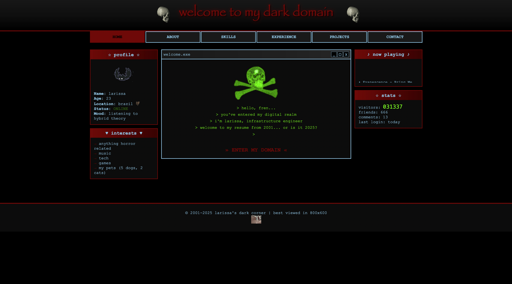

# Retro PC Interactive Resume - Windows XP Emulation

Welcome to my interactive resume project! This is a retro-inspired portfolio site that emulates a classic **Windows XP** PC. It’s not just a creative way to present my work, but also a tribute to the technology of the early 2000s, designed to capture the nostalgia of my first experiences with computers.

---

## **Why Retro?**

- **Personal Connection**: This project reflects my love for the aesthetics of the early 2000s. The look and feel are inspired by the first PC I used — an old, beige, tube monitor. It’s where I spent hours playing games, chatting on MSN, browsing Orkut, and listening to music. This site is a tribute to those moments.
  
- **Band Tribute**: The wallpaper featured in the project is dedicated to one of my favorite bands, which has been a huge part of my life since childhood.

- **The First OS**: The design and feel of the site pay homage to **Windows XP**, the first operating system I ever used. It's my way of honoring that era of computing.

---

## **Project Concept**

- **Minimalist Design**: I've kept the design simple yet nostalgic, featuring only three classic programs — **Internet Explorer**, **Notepad**, and **Recycle Bin**. The simplicity adds to the retro aesthetic, evoking the look and functionality of old-school desktops.

- **Future Features**: While the taskbar won’t be interactive for now, I’m considering adding interactivity to it in the future as I continue to develop the project.

---

## **How It Works**

- **Interactive Experience**: Clicking on **Internet Explorer** takes you to my resume presented in a fun, retro-inspired style, reminiscent of the early web. It’s a straightforward, nostalgic browsing experience showcasing my professional journey, education, and contact information.

- **Notepad Plans**: I have future plans for **Notepad** to incorporate some interactive features, but this will come after the foundational design is completed.

---

## **Tech Stack**

This project is built using the following technologies:

- **HTML**: Structure and content
- **CSS**: Styling and layout
- **JavaScript**: Future integration for interactivity

---

## **Inspirations**

- **Retro PCs**: Inspired by the beige tube monitors from the early 2000s, which were my first introduction to computers.
- **Windows XP Emulator**: The site [TurboWarp](https://turbowarp.org/235298186/fullscreen) served as a design reference for the Windows XP emulation.
- **Developer Ste_16bit**: Inspired by Ste_16bit's retro personal PC project shared on [Twitter](https://twitter.com/ste_16bit).

---

## **Current Status**

- The site is currently live with HTML and CSS fully implemented.
- **JavaScript** for interactivity is planned for future updates once the aesthetic elements are complete.
- If you'd like to check it out, feel free to visit the live site or follow along with the GitHub project.

---

## **Check It Out!**

- **Live site**: [cv.ldmrqs.com](http://cv.ldmrqs.com)
- **GitHub repository**: [Retro PC Interactive Resume](https://github.com/ldmrqs/CurriculoWinXP)

---

## **Future Plans**

- Integrate JavaScript for more interactive features.
- Enhance the taskbar and possibly introduce more classic programs.
- Create a video demonstrating the website in action.